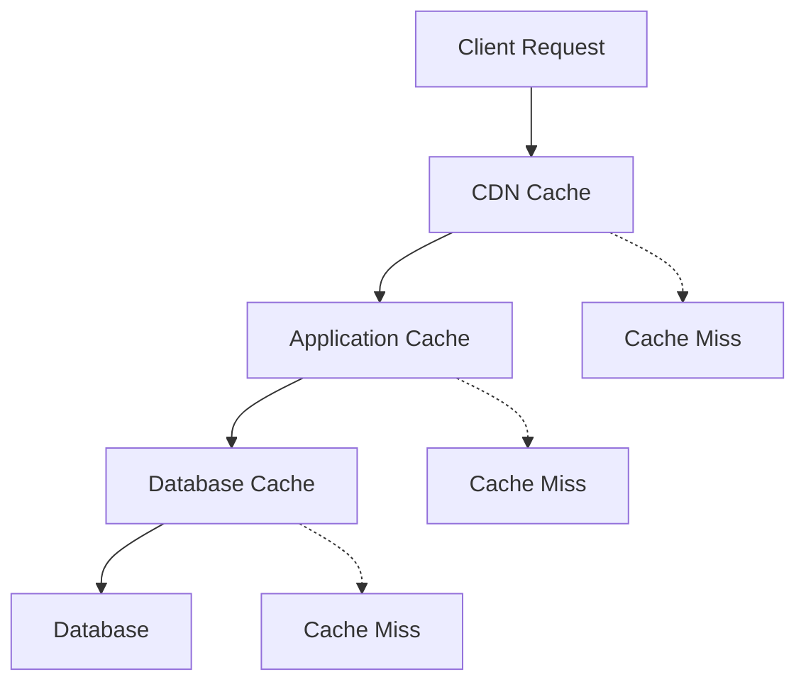

# Performance Optimization Guide

Comprehensive guide for optimizing performance in the JSON CMS Boilerplate system.

## Overview

This guide covers caching strategies, performance monitoring, optimization techniques, and best practices for achieving optimal performance in production environments.

## Caching Architecture

### Multi-Level Caching Strategy



### 1. CDN Caching

Configure CDN for static assets and cacheable content:

```typescript
// next.config.js
module.exports = {
  async headers() {
    return [
      {
        source: '/api/cms/pages/:slug*',
        headers: [
          {
            key: 'Cache-Control',
            value: 'public, s-maxage=3600, stale-while-revalidate=86400'
          },
          {
            key: 'CDN-Cache-Control',
            value: 'public, max-age=86400'
          }
        ]
      },
      {
        source: '/cms/assets/:path*',
        headers: [
          {
            key: 'Cache-Control',
            value: 'public, max-age=31536000, immutable'
          }
        ]
      }
    ];
  }
};
```

### 2. Application-Level Caching

#### Memory Cache Implementation

```typescript
// src/lib/cache/memory-cache.ts
export class MemoryCache implements CacheManager {
  private cache = new Map<string, CacheEntry>();
  private timers = new Map<string, NodeJS.Timeout>();

  async get<T>(key: string): Promise<T | null> {
    const entry = this.cache.get(key);
    
    if (!entry) return null;
    
    if (entry.expiresAt && Date.now() > entry.expiresAt) {
      this.delete(key);
      return null;
    }
    
    // Update access time for LRU
    entry.lastAccessed = Date.now();
    return entry.value as T;
  }

  async set<T>(key: string, value: T, ttl?: number): Promise<void> {
    const expiresAt = ttl ? Date.now() + ttl * 1000 : undefined;
    
    this.cache.set(key, {
      value,
      expiresAt,
      lastAccessed: Date.now(),
      size: this.calculateSize(value)
    });

    if (ttl) {
      const timer = setTimeout(() => this.delete(key), ttl * 1000);
      this.timers.set(key, timer);
    }

    // Implement LRU eviction if cache is full
    this.evictIfNecessary();
  }

  private evictIfNecessary(): void {
    const maxSize = 100 * 1024 * 1024; // 100MB
    const currentSize = this.getCurrentSize();
    
    if (currentSize > maxSize) {
      const entries = Array.from(this.cache.entries())
        .sort(([, a], [, b]) => a.lastAccessed - b.lastAccessed);
      
      // Remove oldest entries until under limit
      for (const [key] of entries) {
        this.delete(key);
        if (this.getCurrentSize() <= maxSize * 0.8) break;
      }
    }
  }
}
```

#### Redis Cache Implementation

```typescript
// src/lib/cache/redis-cache.ts
export class RedisCache implements CacheManager {
  private client: Redis;

  constructor(config: RedisConfig) {
    this.client = new Redis(config);
  }

  async get<T>(key: string): Promise<T | null> {
    try {
      const value = await this.client.get(key);
      return value ? JSON.parse(value) : null;
    } catch (error) {
      console.error('Redis get error:', error);
      return null;
    }
  }

  async set<T>(key: string, value: T, ttl?: number): Promise<void> {
    try {
      const serialized = JSON.stringify(value);
      
      if (ttl) {
        await this.client.setex(key, ttl, serialized);
      } else {
        await this.client.set(key, serialized);
      }
    } catch (error) {
      console.error('Redis set error:', error);
    }
  }

  async invalidatePattern(pattern: string): Promise<void> {
    try {
      const keys = await this.client.keys(pattern);
      if (keys.length > 0) {
        await this.client.del(...keys);
      }
    } catch (error) {
      console.error('Redis invalidate error:', error);
    }
  }

  // Batch operations for better performance
  async mget<T>(keys: string[]): Promise<(T | null)[]> {
    try {
      const values = await this.client.mget(...keys);
      return values.map(v => v ? JSON.parse(v) : null);
    } catch (error) {
      console.error('Redis mget error:', error);
      return keys.map(() => null);
    }
  }

  async mset(entries: Array<[string, any, number?]>): Promise<void> {
    const pipeline = this.client.pipeline();
    
    for (const [key, value, ttl] of entries) {
      const serialized = JSON.stringify(value);
      if (ttl) {
        pipeline.setex(key, ttl, serialized);
      } else {
        pipeline.set(key, serialized);
      }
    }
    
    await pipeline.exec();
  }
}
```

### 3. Database Query Caching

```typescript
// src/lib/cache/query-cache.ts
export class QueryCache {
  constructor(private cache: CacheManager) {}

  async cachedQuery<T>(
    key: string,
    queryFn: () => Promise<T>,
    ttl: number = 300
  ): Promise<T> {
    // Try cache first
    const cached = await this.cache.get<T>(key);
    if (cached) return cached;

    // Execute query
    const result = await queryFn();
    
    // Cache result
    await this.cache.set(key, result, ttl);
    
    return result;
  }

  generateKey(table: string, conditions: Record<string, any>): string {
    const sortedConditions = Object.keys(conditions)
      .sort()
      .map(k => `${k}:${conditions[k]}`)
      .join('|');
    
    return `query:${table}:${this.hash(sortedConditions)}`;
  }

  private hash(str: string): string {
    return crypto.createHash('md5').update(str).digest('hex');
  }
}
```

## Cache Strategies

### 1. Cache-Aside Pattern

```typescript
// Manual cache management
export class ContentService {
  async getPage(slug: string): Promise<PageData> {
    const cacheKey = `page:${slug}`;
    
    // Try cache first
    let page = await this.cache.get<PageData>(cacheKey);
    
    if (!page) {
      // Load from database
      page = await this.database.getPage(slug);
      
      if (page) {
        // Cache for 1 hour
        await this.cache.set(cacheKey, page, 3600);
      }
    }
    
    return page;
  }

  async updatePage(slug: string, data: Partial<PageData>): Promise<PageData> {
    // Update database
    const page = await this.database.updatePage(slug, data);
    
    // Invalidate cache
    await this.cache.delete(`page:${slug}`);
    
    // Optionally warm cache
    await this.cache.set(`page:${slug}`, page, 3600);
    
    return page;
  }
}
```

### 2. Write-Through Pattern

```typescript
// Automatic cache updates
export class WriteThroughCache {
  async set<T>(key: string, value: T): Promise<void> {
    // Write to database first
    await this.database.set(key, value);
    
    // Then update cache
    await this.cache.set(key, value);
  }

  async get<T>(key: string): Promise<T | null> {
    // Always read from cache
    return await this.cache.get<T>(key);
  }
}
```

### 3. Write-Behind Pattern

```typescript
// Delayed database writes
export class WriteBehindCache {
  private writeQueue = new Map<string, any>();
  private flushTimer: NodeJS.Timeout;

  constructor() {
    // Flush every 5 seconds
    this.flushTimer = setInterval(() => this.flush(), 5000);
  }

  async set<T>(key: string, value: T): Promise<void> {
    // Update cache immediately
    await this.cache.set(key, value);
    
    // Queue for database write
    this.writeQueue.set(key, value);
  }

  private async flush(): Promise<void> {
    if (this.writeQueue.size === 0) return;

    const entries = Array.from(this.writeQueue.entries());
    this.writeQueue.clear();

    // Batch write to database
    await this.database.batchSet(entries);
  }
}
```

## Performance Monitoring

### 1. Metrics Collection

```typescript
// src/lib/monitoring/performance-monitor.ts
export class PerformanceMonitor {
  private metrics = new Map<string, Metric[]>();

  trackPageLoad(pageId: string, metrics: PageMetrics): void {
    this.recordMetric('page_load', {
      pageId,
      loadTime: metrics.loadTime,
      renderTime: metrics.renderTime,
      cacheHit: metrics.cacheHit,
      timestamp: Date.now()
    });
  }

  trackAPICall(endpoint: string, duration: number, status: number): void {
    this.recordMetric('api_call', {
      endpoint,
      duration,
      status,
      timestamp: Date.now()
    });
  }

  trackCacheOperation(operation: string, key: string, hit: boolean, duration: number): void {
    this.recordMetric('cache_operation', {
      operation,
      key: this.hashKey(key),
      hit,
      duration,
      timestamp: Date.now()
    });
  }

  async getInsights(timeRange: TimeRange): Promise<PerformanceInsights> {
    const metrics = this.getMetricsInRange(timeRange);
    
    return {
      averagePageLoad: this.calculateAverage(metrics.page_load, 'loadTime'),
      cacheHitRate: this.calculateCacheHitRate(metrics.cache_operation),
      slowestEndpoints: this.findSlowestEndpoints(metrics.api_call),
      recommendations: this.generateRecommendations(metrics)
    };
  }

  private generateRecommendations(metrics: MetricCollection): Recommendation[] {
    const recommendations: Recommendation[] = [];
    
    // Check cache hit rate
    const cacheHitRate = this.calculateCacheHitRate(metrics.cache_operation);
    if (cacheHitRate < 0.8) {
      recommendations.push({
        type: 'cache_optimization',
        priority: 'high',
        message: `Cache hit rate is ${(cacheHitRate * 100).toFixed(1)}%. Consider increasing TTL or cache size.`
      });
    }
    
    // Check slow API endpoints
    const slowEndpoints = this.findSlowestEndpoints(metrics.api_call);
    if (slowEndpoints.length > 0) {
      recommendations.push({
        type: 'api_optimization',
        priority: 'medium',
        message: `Slow endpoints detected: ${slowEndpoints.map(e => e.endpoint).join(', ')}`
      });
    }
    
    return recommendations;
  }
}
```

### 2. Real-Time Monitoring Dashboard

```typescript
// src/lib/monitoring/dashboard.ts
export class MonitoringDashboard {
  async getSystemHealth(): Promise<SystemHealth> {
    const [
      cacheStats,
      databaseStats,
      apiStats,
      memoryUsage
    ] = await Promise.all([
      this.getCacheStats(),
      this.getDatabaseStats(),
      this.getAPIStats(),
      this.getMemoryUsage()
    ]);

    return {
      status: this.calculateOverallStatus([cacheStats, databaseStats, apiStats]),
      cache: cacheStats,
      database: databaseStats,
      api: apiStats,
      memory: memoryUsage,
      timestamp: new Date()
    };
  }

  private async getCacheStats(): Promise<CacheStats> {
    const stats = await this.cache.getStats();
    
    return {
      hitRate: stats.hits / (stats.hits + stats.misses),
      size: stats.size,
      evictions: stats.evictions,
      status: stats.hitRate > 0.8 ? 'healthy' : 'warning'
    };
  }

  private async getDatabaseStats(): Promise<DatabaseStats> {
    const stats = await this.database.getStats();
    
    return {
      connectionCount: stats.activeConnections,
      averageQueryTime: stats.averageQueryTime,
      slowQueries: stats.slowQueries,
      status: stats.averageQueryTime < 100 ? 'healthy' : 'warning'
    };
  }
}
```

## Optimization Techniques

### 1. Component-Level Optimization

```typescript
// Optimize React components
import { memo, useMemo, useCallback } from 'react';

export const OptimizedComponent = memo(function OptimizedComponent({ 
  data, 
  onUpdate 
}: ComponentProps) {
  // Memoize expensive calculations
  const processedData = useMemo(() => {
    return expensiveDataProcessing(data);
  }, [data]);

  // Memoize callbacks to prevent re-renders
  const handleUpdate = useCallback((id: string, value: any) => {
    onUpdate(id, value);
  }, [onUpdate]);

  return (
    <div>
      {processedData.map(item => (
        <OptimizedChildComponent
          key={item.id}
          item={item}
          onUpdate={handleUpdate}
        />
      ))}
    </div>
  );
});
```

### 2. Database Query Optimization

```typescript
// Optimize database queries
export class OptimizedRepository {
  // Use indexes effectively
  async getPagesByCategory(category: string): Promise<PageData[]> {
    return this.db.query(`
      SELECT p.*, COUNT(v.id) as view_count
      FROM cms_pages p
      LEFT JOIN page_views v ON p.id = v.page_id
      WHERE p.category = $1 
        AND p.status = 'published'
      GROUP BY p.id
      ORDER BY view_count DESC, p.updated_at DESC
      LIMIT 50
    `, [category]);
  }

  // Batch operations
  async getMultiplePages(slugs: string[]): Promise<PageData[]> {
    return this.db.query(`
      SELECT * FROM cms_pages 
      WHERE slug = ANY($1)
    `, [slugs]);
  }

  // Use prepared statements
  private getPageStatement = this.db.prepare(`
    SELECT * FROM cms_pages 
    WHERE slug = $1 AND status = 'published'
  `);

  async getPage(slug: string): Promise<PageData | null> {
    const result = await this.getPageStatement.execute([slug]);
    return result.rows[0] || null;
  }
}
```

### 3. Bundle Optimization

```javascript
// next.config.js
const withBundleAnalyzer = require('@next/bundle-analyzer')({
  enabled: process.env.ANALYZE === 'true'
});

module.exports = withBundleAnalyzer({
  // Code splitting
  experimental: {
    optimizeCss: true,
    optimizePackageImports: ['@upflame/json-cms']
  },

  // Compression
  compress: true,

  // Image optimization
  images: {
    domains: ['your-cdn.com'],
    formats: ['image/webp', 'image/avif'],
    minimumCacheTTL: 86400
  },

  // Webpack optimization
  webpack: (config, { dev, isServer }) => {
    if (!dev && !isServer) {
      // Tree shaking
      config.optimization.usedExports = true;
      
      // Split chunks
      config.optimization.splitChunks = {
        chunks: 'all',
        cacheGroups: {
          cms: {
            name: 'cms',
            test: /[\/]node_modules[\/]@upflame[\/]json-cms/,
            priority: 30,
            reuseExistingChunk: true
          }
        }
      };
    }
    
    return config;
  }
});
```

## Cache Invalidation Strategies

### 1. Time-Based Invalidation

```typescript
// TTL-based cache invalidation
export class TTLCacheManager {
  async setWithTTL<T>(key: string, value: T, ttl: number): Promise<void> {
    await this.cache.set(key, {
      value,
      expiresAt: Date.now() + ttl * 1000
    });
  }

  async get<T>(key: string): Promise<T | null> {
    const cached = await this.cache.get(key);
    
    if (!cached) return null;
    
    if (Date.now() > cached.expiresAt) {
      await this.cache.delete(key);
      return null;
    }
    
    return cached.value;
  }
}
```

### 2. Event-Based Invalidation

```typescript
// Invalidate cache on content changes
export class EventBasedInvalidation {
  constructor(private cache: CacheManager, private eventBus: EventBus) {
    this.setupEventHandlers();
  }

  private setupEventHandlers(): void {
    this.eventBus.on('page.updated', async (event) => {
      await this.invalidatePageCache(event.pageId);
    });

    this.eventBus.on('block.updated', async (event) => {
      await this.invalidateBlockCache(event.blockId);
      // Also invalidate pages that use this block
      await this.invalidatePagesUsingBlock(event.blockId);
    });

    this.eventBus.on('component.updated', async (event) => {
      // Invalidate all content using this component
      await this.invalidateByComponentType(event.componentType);
    });
  }

  private async invalidatePageCache(pageId: string): Promise<void> {
    const patterns = [
      `page:${pageId}`,
      `page:${pageId}:*`,
      `api:pages:${pageId}`,
      `seo:page:${pageId}`
    ];

    await Promise.all(
      patterns.map(pattern => this.cache.invalidate(pattern))
    );
  }
}
```

### 3. Dependency-Based Invalidation

```typescript
// Track cache dependencies
export class DependencyTracker {
  private dependencies = new Map<string, Set<string>>();

  addDependency(cacheKey: string, dependency: string): void {
    if (!this.dependencies.has(dependency)) {
      this.dependencies.set(dependency, new Set());
    }
    this.dependencies.get(dependency)!.add(cacheKey);
  }

  async invalidateDependents(dependency: string): Promise<void> {
    const dependentKeys = this.dependencies.get(dependency);
    
    if (dependentKeys) {
      await Promise.all(
        Array.from(dependentKeys).map(key => this.cache.delete(key))
      );
      
      // Clear the dependency tracking
      this.dependencies.delete(dependency);
    }
  }

  // Usage example
  async getCachedPageWithDependencies(slug: string): Promise<PageData> {
    const cacheKey = `page:${slug}`;
    
    let page = await this.cache.get<PageData>(cacheKey);
    
    if (!page) {
      page = await this.database.getPage(slug);
      
      // Track dependencies
      this.addDependency(cacheKey, `page:${page.id}`);
      page.blocks.forEach(block => {
        this.addDependency(cacheKey, `block:${block.id}`);
      });
      
      await this.cache.set(cacheKey, page, 3600);
    }
    
    return page;
  }
}
```

## Performance Best Practices

### 1. API Optimization

```typescript
// Implement efficient pagination
export class PaginatedAPI {
  async getPages(params: PaginationParams): Promise<PaginatedResult<PageData>> {
    const { limit = 20, cursor, filters } = params;
    
    // Use cursor-based pagination for better performance
    const query = this.buildQuery(filters);
    if (cursor) {
      query.where('created_at', '<', cursor);
    }
    
    const pages = await query
      .orderBy('created_at', 'desc')
      .limit(limit + 1); // Get one extra to check if there are more
    
    const hasMore = pages.length > limit;
    if (hasMore) pages.pop();
    
    return {
      data: pages,
      pagination: {
        hasMore,
        nextCursor: hasMore ? pages[pages.length - 1].createdAt : null
      }
    };
  }

  // Implement field selection
  async getPage(slug: string, fields?: string[]): Promise<Partial<PageData>> {
    const selectFields = fields?.length 
      ? fields.join(', ')
      : '*';
    
    return this.db.query(`
      SELECT ${selectFields} 
      FROM cms_pages 
      WHERE slug = $1
    `, [slug]);
  }
}
```

### 2. Image Optimization

```typescript
// Optimize image delivery
export class ImageOptimizer {
  async optimizeImage(
    src: string, 
    options: ImageOptions
  ): Promise<OptimizedImage> {
    const { width, height, quality = 80, format = 'webp' } = options;
    
    // Generate optimized image URL
    const optimizedUrl = this.generateOptimizedUrl(src, {
      w: width,
      h: height,
      q: quality,
      f: format
    });
    
    // Generate responsive srcSet
    const srcSet = this.generateSrcSet(src, options);
    
    return {
      src: optimizedUrl,
      srcSet,
      placeholder: await this.generatePlaceholder(src)
    };
  }

  private generateSrcSet(src: string, options: ImageOptions): string {
    const sizes = [480, 768, 1024, 1280, 1920];
    
    return sizes
      .filter(size => !options.width || size <= options.width)
      .map(size => {
        const url = this.generateOptimizedUrl(src, {
          ...options,
          w: size
        });
        return `${url} ${size}w`;
      })
      .join(', ');
  }
}
```

### 3. Database Connection Pooling

```typescript
// Optimize database connections
export class DatabasePool {
  private pool: Pool;

  constructor(config: DatabaseConfig) {
    this.pool = new Pool({
      ...config,
      // Connection pool settings
      min: 2,
      max: 20,
      acquireTimeoutMillis: 30000,
      createTimeoutMillis: 30000,
      destroyTimeoutMillis: 5000,
      idleTimeoutMillis: 30000,
      reapIntervalMillis: 1000,
      createRetryIntervalMillis: 100,
      
      // Connection validation
      validate: (connection) => {
        return connection.isConnected();
      }
    });
  }

  async query<T>(sql: string, params?: any[]): Promise<T[]> {
    const client = await this.pool.connect();
    
    try {
      const result = await client.query(sql, params);
      return result.rows;
    } finally {
      client.release();
    }
  }

  async transaction<T>(callback: (trx: Transaction) => Promise<T>): Promise<T> {
    const client = await this.pool.connect();
    
    try {
      await client.query('BEGIN');
      const result = await callback(client);
      await client.query('COMMIT');
      return result;
    } catch (error) {
      await client.query('ROLLBACK');
      throw error;
    } finally {
      client.release();
    }
  }
}
```

## Load Testing

### 1. API Load Testing

```javascript
// k6 load test script
import http from 'k6/http';
import { check, sleep } from 'k6';

export let options = {
  stages: [
    { duration: '2m', target: 100 }, // Ramp up
    { duration: '5m', target: 100 }, // Stay at 100 users
    { duration: '2m', target: 200 }, // Ramp up to 200 users
    { duration: '5m', target: 200 }, // Stay at 200 users
    { duration: '2m', target: 0 },   // Ramp down
  ],
  thresholds: {
    http_req_duration: ['p(95)<500'], // 95% of requests under 500ms
    http_req_failed: ['rate<0.1'],    // Error rate under 10%
  },
};

export default function() {
  // Test page API
  let response = http.get('http://localhost:3000/api/cms/pages/homepage');
  check(response, {
    'status is 200': (r) => r.status === 200,
    'response time < 500ms': (r) => r.timings.duration < 500,
  });

  // Test blocks API
  response = http.get('http://localhost:3000/api/cms/blocks');
  check(response, {
    'status is 200': (r) => r.status === 200,
    'has blocks': (r) => JSON.parse(r.body).data.blocks.length > 0,
  });

  sleep(1);
}
```

### 2. Database Load Testing

```typescript
// Database performance testing
export class DatabaseLoadTester {
  async runLoadTest(config: LoadTestConfig): Promise<LoadTestResult> {
    const { concurrency, duration, operations } = config;
    const results: OperationResult[] = [];
    
    const startTime = Date.now();
    const endTime = startTime + duration;
    
    // Create concurrent workers
    const workers = Array.from({ length: concurrency }, () => 
      this.runWorker(endTime, operations, results)
    );
    
    await Promise.all(workers);
    
    return this.analyzeResults(results);
  }

  private async runWorker(
    endTime: number,
    operations: Operation[],
    results: OperationResult[]
  ): Promise<void> {
    while (Date.now() < endTime) {
      const operation = operations[Math.floor(Math.random() * operations.length)];
      const startTime = Date.now();
      
      try {
        await this.executeOperation(operation);
        results.push({
          operation: operation.name,
          duration: Date.now() - startTime,
          success: true
        });
      } catch (error) {
        results.push({
          operation: operation.name,
          duration: Date.now() - startTime,
          success: false,
          error: error.message
        });
      }
      
      await this.sleep(operation.delay || 0);
    }
  }
}
```

This comprehensive performance guide ensures your CMS operates efficiently at scale with optimal caching, monitoring, and optimization strategies.
