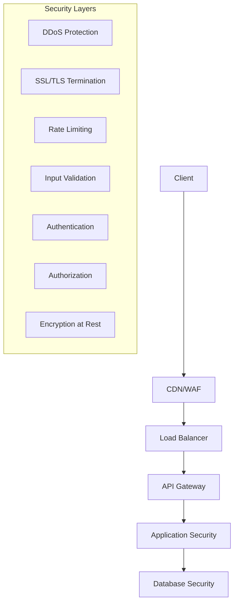

# Security Configuration Guide

Comprehensive security guide for the JSON CMS Boilerplate system covering authentication, authorization, data protection, and security best practices.

## Security Architecture

### Defense in Depth Strategy



## Authentication & Authorization

### 1. JWT Authentication

```typescript
// src/lib/auth/jwt-manager.ts
import jwt from 'jsonwebtoken';
import { JWTPayload, AuthConfig } from './types';

export class JWTManager {
  constructor(private config: AuthConfig) {}

  generateToken(payload: JWTPayload): string {
    return jwt.sign(
      {
        ...payload,
        iat: Math.floor(Date.now() / 1000),
        exp: Math.floor(Date.now() / 1000) + this.config.tokenExpiry
      },
      this.config.secret,
      {
        algorithm: 'HS256',
        issuer: this.config.issuer,
        audience: this.config.audience
      }
    );
  }

  verifyToken(token: string): JWTPayload | null {
    try {
      const decoded = jwt.verify(token, this.config.secret, {
        algorithms: ['HS256'],
        issuer: this.config.issuer,
        audience: this.config.audience
      }) as JWTPayload;

      // Check if token is blacklisted
      if (this.isTokenBlacklisted(decoded.jti)) {
        return null;
      }

      return decoded;
    } catch (error) {
      console.error('JWT verification failed:', error.message);
      return null;
    }
  }

  refreshToken(token: string): string | null {
    const payload = this.verifyToken(token);
    if (!payload) return null;

    // Check if token is eligible for refresh (within refresh window)
    const now = Math.floor(Date.now() / 1000);
    const refreshWindow = this.config.refreshWindow || 3600; // 1 hour
    
    if (payload.exp - now > refreshWindow) {
      return null; // Token too fresh to refresh
    }

    // Blacklist old token
    this.blacklistToken(payload.jti);

    // Generate new token
    return this.generateToken({
      userId: payload.userId,
      tenantId: payload.tenantId,
      roles: payload.roles,
      permissions: payload.permissions
    });
  }

  private isTokenBlacklisted(jti: string): boolean {
    // Implementation depends on your blacklist storage (Redis, database, etc.)
    return this.tokenBlacklist.has(jti);
  }

  private blacklistToken(jti: string): void {
    this.tokenBlacklist.add(jti, this.config.tokenExpiry);
  }
}
```

### 2. Role-Based Access Control (RBAC)

```typescript
// src/lib/auth/rbac-manager.ts
export class RBACManager {
  private roleHierarchy: Map<string, string[]> = new Map([
    ['admin', ['editor', 'viewer']],
    ['editor', ['viewer']],
    ['viewer', []]
  ]);

  private permissions: Map<string, string[]> = new Map([
    ['admin', ['*']], // All permissions
    ['editor', [
      'pages:read', 'pages:write', 'pages:delete',
      'blocks:read', 'blocks:write', 'blocks:delete',
      'components:read'
    ]],
    ['viewer', ['pages:read', 'blocks:read', 'components:read']]
  ]);

  hasPermission(
    userRoles: string[], 
    requiredPermission: string,
    context?: AuthContext
  ): boolean {
    // Check for wildcard permission
    if (this.hasWildcardPermission(userRoles)) {
      return true;
    }

    // Check direct permission
    if (this.hasDirectPermission(userRoles, requiredPermission)) {
      return true;
    }

    // Check context-specific permissions
    if (context && this.hasContextualPermission(userRoles, requiredPermission, context)) {
      return true;
    }

    return false;
  }

  private hasWildcardPermission(userRoles: string[]): boolean {
    return userRoles.some(role => {
      const rolePermissions = this.permissions.get(role) || [];
      return rolePermissions.includes('*');
    });
  }

  private hasDirectPermission(userRoles: string[], permission: string): boolean {
    const allUserPermissions = this.getAllUserPermissions(userRoles);
    return allUserPermissions.includes(permission);
  }

  private getAllUserPermissions(userRoles: string[]): string[] {
    const allPermissions = new Set<string>();

    for (const role of userRoles) {
      // Add direct permissions
      const rolePermissions = this.permissions.get(role) || [];
      rolePermissions.forEach(p => allPermissions.add(p));

      // Add inherited permissions
      const inheritedRoles = this.roleHierarchy.get(role) || [];
      const inheritedPermissions = this.getAllUserPermissions(inheritedRoles);
      inheritedPermissions.forEach(p => allPermissions.add(p));
    }

    return Array.from(allPermissions);
  }

  private hasContextualPermission(
    userRoles: string[], 
    permission: string, 
    context: AuthContext
  ): boolean {
    // Check tenant-specific permissions
    if (context.tenantId && context.userTenantId === context.tenantId) {
      return this.hasDirectPermission(userRoles, permission);
    }

    // Check resource ownership
    if (context.resourceOwnerId === context.userId) {
      const ownerPermissions = [`${permission}:own`];
      return this.hasDirectPermission(userRoles, ownerPermissions[0]);
    }

    return false;
  }
}
```

### 3. Authentication Middleware

```typescript
// src/lib/auth/middleware.ts
export function createAuthMiddleware(config: AuthMiddlewareConfig) {
  return async (request: NextRequest): Promise<NextResponse | void> => {
    const { pathname } = request.nextUrl;

    // Skip auth for public routes
    if (config.publicRoutes.some(route => pathname.startsWith(route))) {
      return;
    }

    // Extract token
    const token = extractToken(request);
    if (!token) {
      return new NextResponse('Unauthorized', { status: 401 });
    }

    // Verify token
    const jwtManager = new JWTManager(config.jwt);
    const payload = jwtManager.verifyToken(token);
    
    if (!payload) {
      return new NextResponse('Invalid token', { status: 401 });
    }

    // Check permissions for protected routes
    const rbac = new RBACManager();
    const requiredPermission = getRequiredPermission(pathname, request.method);
    
    if (requiredPermission && !rbac.hasPermission(payload.roles, requiredPermission)) {
      return new NextResponse('Forbidden', { status: 403 });
    }

    // Add user context to request headers
    const requestHeaders = new Headers(request.headers);
    requestHeaders.set('x-user-id', payload.userId);
    requestHeaders.set('x-user-roles', payload.roles.join(','));
    requestHeaders.set('x-tenant-id', payload.tenantId || '');

    return NextResponse.next({
      request: { headers: requestHeaders }
    });
  };
}

function extractToken(request: NextRequest): string | null {
  // Try Authorization header first
  const authHeader = request.headers.get('authorization');
  if (authHeader?.startsWith('Bearer ')) {
    return authHeader.substring(7);
  }

  // Try cookie as fallback
  const tokenCookie = request.cookies.get('auth-token');
  return tokenCookie?.value || null;
}

function getRequiredPermission(pathname: string, method: string): string | null {
  const routePermissions: Record<string, Record<string, string>> = {
    '/api/cms/pages': {
      'GET': 'pages:read',
      'POST': 'pages:write',
      'PUT': 'pages:write',
      'DELETE': 'pages:delete'
    },
    '/api/cms/blocks': {
      'GET': 'blocks:read',
      'POST': 'blocks:write',
      'PUT': 'blocks:write',
      'DELETE': 'blocks:delete'
    }
  };

  // Find matching route pattern
  for (const [route, methods] of Object.entries(routePermissions)) {
    if (pathname.startsWith(route)) {
      return methods[method] || null;
    }
  }

  return null;
}
```

## Input Validation & Sanitization

### 1. Schema Validation

```typescript
// src/lib/security/input-validator.ts
import { z } from 'zod';
import DOMPurify from 'isomorphic-dompurify';

export class InputValidator {
  // Page validation schema
  private pageSchema = z.object({
    slug: z.string()
      .min(1)
      .max(255)
      .regex(/^[a-z0-9-_\/]+$/, 'Invalid slug format'),
    title: z.string()
      .min(1)
      .max(500)
      .transform(str => this.sanitizeHTML(str)),
    description: z.string()
      .max(1000)
      .optional()
      .transform(str => str ? this.sanitizeHTML(str) : str),
    content: z.object({
      blocks: z.array(z.object({
        id: z.string().uuid(),
        componentType: z.string().regex(/^[A-Za-z][A-Za-z0-9]*$/),
        props: z.record(z.any()).refine(
          props => this.validateComponentProps(props),
          'Invalid component props'
        )
      }))
    }),
    seo: z.object({
      title: z.string().max(60).optional(),
      description: z.string().max(160).optional(),
      canonical: z.string().url().optional(),
      robots: z.enum(['index,follow', 'noindex,nofollow', 'index,nofollow', 'noindex,follow']).optional()
    }).optional(),
    status: z.enum(['draft', 'published', 'archived']).default('draft')
  });

  validatePageData(data: unknown): PageData {
    try {
      return this.pageSchema.parse(data);
    } catch (error) {
      if (error instanceof z.ZodError) {
        throw new ValidationError('Invalid page data', error.errors);
      }
      throw error;
    }
  }

  private sanitizeHTML(html: string): string {
    return DOMPurify.sanitize(html, {
      ALLOWED_TAGS: ['p', 'br', 'strong', 'em', 'u', 'a', 'ul', 'ol', 'li'],
      ALLOWED_ATTR: ['href', 'target', 'rel'],
      ALLOW_DATA_ATTR: false
    });
  }

  private validateComponentProps(props: Record<string, any>): boolean {
    // Recursively sanitize string values
    for (const [key, value] of Object.entries(props)) {
      if (typeof value === 'string') {
        props[key] = this.sanitizeHTML(value);
      } else if (typeof value === 'object' && value !== null) {
        this.validateComponentProps(value);
      }
    }
    return true;
  }

  // SQL injection prevention
  sanitizeSQL(input: string): string {
    return input.replace(/['"\\;]/g, '');
  }

  // XSS prevention for dynamic content
  sanitizeForOutput(content: string, context: 'html' | 'attribute' | 'javascript' = 'html'): string {
    switch (context) {
      case 'html':
        return DOMPurify.sanitize(content);
      case 'attribute':
        return content.replace(/[<>"'&]/g, (match) => {
          const entities: Record<string, string> = {
            '<': '&lt;',
            '>': '&gt;',
            '"': '&quot;',
            "'": '&#x27;',
            '&': '&amp;'
          };
          return entities[match];
        });
      case 'javascript':
        return JSON.stringify(content).slice(1, -1); // Remove quotes
      default:
        return content;
    }
  }
}
```

### 2. Rate Limiting

```typescript
// src/lib/security/rate-limiter.ts
export class RateLimiter {
  private store: Map<string, RateLimitEntry> = new Map();
  private cleanupInterval: NodeJS.Timeout;

  constructor(private config: RateLimitConfig) {
    // Cleanup expired entries every minute
    this.cleanupInterval = setInterval(() => this.cleanup(), 60000);
  }

  async checkLimit(
    identifier: string, 
    action: string = 'default'
  ): Promise<RateLimitResult> {
    const key = `${identifier}:${action}`;
    const now = Date.now();
    const window = this.config.windowMs;
    const limit = this.config.limits[action] || this.config.limits.default;

    let entry = this.store.get(key);
    
    if (!entry || now - entry.windowStart > window) {
      // New window
      entry = {
        count: 1,
        windowStart: now,
        resetTime: now + window
      };
    } else {
      // Within current window
      entry.count++;
    }

    this.store.set(key, entry);

    const remaining = Math.max(0, limit - entry.count);
    const exceeded = entry.count > limit;

    return {
      allowed: !exceeded,
      limit,
      remaining,
      resetTime: entry.resetTime,
      retryAfter: exceeded ? Math.ceil((entry.resetTime - now) / 1000) : 0
    };
  }

  async recordRequest(identifier: string, action: string = 'default'): Promise<void> {
    const result = await this.checkLimit(identifier, action);
    
    if (!result.allowed) {
      throw new RateLimitExceededError(
        `Rate limit exceeded for ${action}`,
        result.retryAfter
      );
    }
  }

  private cleanup(): void {
    const now = Date.now();
    
    for (const [key, entry] of this.store.entries()) {
      if (now > entry.resetTime) {
        this.store.delete(key);
      }
    }
  }

  // Advanced rate limiting with different strategies
  async checkAdvancedLimit(
    identifier: string,
    strategy: RateLimitStrategy
  ): Promise<RateLimitResult> {
    switch (strategy.type) {
      case 'sliding_window':
        return this.checkSlidingWindow(identifier, strategy);
      case 'token_bucket':
        return this.checkTokenBucket(identifier, strategy);
      case 'leaky_bucket':
        return this.checkLeakyBucket(identifier, strategy);
      default:
        return this.checkLimit(identifier);
    }
  }

  private async checkSlidingWindow(
    identifier: string,
    strategy: SlidingWindowStrategy
  ): Promise<RateLimitResult> {
    const key = `sliding:${identifier}`;
    const now = Date.now();
    const window = strategy.windowMs;
    
    let requests = this.store.get(key)?.requests || [];
    
    // Remove requests outside the window
    requests = requests.filter(timestamp => now - timestamp < window);
    
    const allowed = requests.length < strategy.limit;
    
    if (allowed) {
      requests.push(now);
      this.store.set(key, { requests, windowStart: now, resetTime: now + window, count: requests.length });
    }

    return {
      allowed,
      limit: strategy.limit,
      remaining: Math.max(0, strategy.limit - requests.length),
      resetTime: now + window,
      retryAfter: allowed ? 0 : Math.ceil(window / 1000)
    };
  }
}
```

## Content Security Policy (CSP)

### 1. CSP Configuration

```typescript
// src/lib/security/csp-manager.ts
export class CSPManager {
  private config: CSPConfig;

  constructor(config: CSPConfig) {
    this.config = config;
  }

  generateCSPHeader(context: CSPContext): string {
    const directives: string[] = [];

    // Default source
    directives.push(`default-src ${this.config.defaultSrc.join(' ')}`);

    // Script sources
    const scriptSrc = [
      ...this.config.scriptSrc,
      ...(context.inlineScripts ? ["'unsafe-inline'"] : []),
      ...(context.nonce ? [`'nonce-${context.nonce}'`] : [])
    ];
    directives.push(`script-src ${scriptSrc.join(' ')}`);

    // Style sources
    const styleSrc = [
      ...this.config.styleSrc,
      ...(context.inlineStyles ? ["'unsafe-inline'"] : [])
    ];
    directives.push(`style-src ${styleSrc.join(' ')}`);

    // Image sources
    directives.push(`img-src ${this.config.imgSrc.join(' ')}`);

    // Font sources
    directives.push(`font-src ${this.config.fontSrc.join(' ')}`);

    // Connect sources (for API calls)
    directives.push(`connect-src ${this.config.connectSrc.join(' ')}`);

    // Frame sources
    directives.push(`frame-src ${this.config.frameSrc.join(' ')}`);

    // Object sources
    directives.push(`object-src ${this.config.objectSrc.join(' ')}`);

    // Base URI
    directives.push(`base-uri ${this.config.baseUri.join(' ')}`);

    // Form action
    directives.push(`form-action ${this.config.formAction.join(' ')}`);

    // Upgrade insecure requests
    if (this.config.upgradeInsecureRequests) {
      directives.push('upgrade-insecure-requests');
    }

    // Block all mixed content
    if (this.config.blockAllMixedContent) {
      directives.push('block-all-mixed-content');
    }

    return directives.join('; ');
  }

  // Generate nonce for inline scripts/styles
  generateNonce(): string {
    return crypto.randomBytes(16).toString('base64');
  }

  // Validate CSP compliance
  validateContent(content: string, type: 'script' | 'style'): CSPValidationResult {
    const issues: CSPIssue[] = [];

    if (type === 'script') {
      // Check for inline event handlers
      const inlineEventPattern = /on\w+\s*=/gi;
      const inlineEvents = content.match(inlineEventPattern);
      if (inlineEvents) {
        issues.push({
          type: 'inline_event_handler',
          severity: 'high',
          message: 'Inline event handlers detected',
          occurrences: inlineEvents
        });
      }

      // Check for eval usage
      const evalPattern = /\beval\s*\(/gi;
      const evalUsage = content.match(evalPattern);
      if (evalUsage) {
        issues.push({
          type: 'eval_usage',
          severity: 'high',
          message: 'eval() usage detected',
          occurrences: evalUsage
        });
      }
    }

    return {
      compliant: issues.length === 0,
      issues
    };
  }
}

// Default CSP configuration
export const defaultCSPConfig: CSPConfig = {
  defaultSrc: ["'self'"],
  scriptSrc: ["'self'", "'unsafe-eval'"], // unsafe-eval needed for Next.js dev
  styleSrc: ["'self'", "'unsafe-inline'", "https://fonts.googleapis.com"],
  imgSrc: ["'self'", "data:", "https:"],
  fontSrc: ["'self'", "https://fonts.gstatic.com"],
  connectSrc: ["'self'"],
  frameSrc: ["'none'"],
  objectSrc: ["'none'"],
  baseUri: ["'self'"],
  formAction: ["'self'"],
  upgradeInsecureRequests: true,
  blockAllMixedContent: false
};
```

### 2. Security Headers Middleware

```typescript
// src/lib/security/security-headers.ts
export function createSecurityHeadersMiddleware(config: SecurityConfig) {
  return (request: NextRequest): NextResponse => {
    const response = NextResponse.next();

    // Content Security Policy
    const cspManager = new CSPManager(config.csp);
    const nonce = cspManager.generateNonce();
    const cspHeader = cspManager.generateCSPHeader({ nonce });
    response.headers.set('Content-Security-Policy', cspHeader);

    // X-Frame-Options
    response.headers.set('X-Frame-Options', 'DENY');

    // X-Content-Type-Options
    response.headers.set('X-Content-Type-Options', 'nosniff');

    // X-XSS-Protection
    response.headers.set('X-XSS-Protection', '1; mode=block');

    // Referrer Policy
    response.headers.set('Referrer-Policy', 'strict-origin-when-cross-origin');

    // Strict Transport Security
    if (config.hsts.enabled) {
      const hstsValue = `max-age=${config.hsts.maxAge}; includeSubDomains${config.hsts.preload ? '; preload' : ''}`;
      response.headers.set('Strict-Transport-Security', hstsValue);
    }

    // Permissions Policy
    if (config.permissionsPolicy) {
      const policies = Object.entries(config.permissionsPolicy)
        .map(([feature, allowlist]) => `${feature}=(${allowlist.join(' ')})`)
        .join(', ');
      response.headers.set('Permissions-Policy', policies);
    }

    // Cross-Origin Embedder Policy
    response.headers.set('Cross-Origin-Embedder-Policy', 'require-corp');

    // Cross-Origin Opener Policy
    response.headers.set('Cross-Origin-Opener-Policy', 'same-origin');

    // Cross-Origin Resource Policy
    response.headers.set('Cross-Origin-Resource-Policy', 'same-origin');

    return response;
  };
}
```

## Data Encryption

### 1. Encryption at Rest

```typescript
// src/lib/security/encryption.ts
import crypto from 'crypto';

export class EncryptionManager {
  private algorithm = 'aes-256-gcm';
  private keyLength = 32; // 256 bits

  constructor(private masterKey: string) {
    if (masterKey.length !== 64) { // 32 bytes in hex
      throw new Error('Master key must be 32 bytes (64 hex characters)');
    }
  }

  encrypt(plaintext: string, additionalData?: string): EncryptedData {
    const key = Buffer.from(this.masterKey, 'hex');
    const iv = crypto.randomBytes(16); // 128-bit IV
    const cipher = crypto.createCipher(this.algorithm, key);

    if (additionalData) {
      cipher.setAAD(Buffer.from(additionalData));
    }

    let encrypted = cipher.update(plaintext, 'utf8', 'hex');
    encrypted += cipher.final('hex');

    const authTag = cipher.getAuthTag();

    return {
      encrypted,
      iv: iv.toString('hex'),
      authTag: authTag.toString('hex'),
      algorithm: this.algorithm
    };
  }

  decrypt(encryptedData: EncryptedData, additionalData?: string): string {
    const key = Buffer.from(this.masterKey, 'hex');
    const iv = Buffer.from(encryptedData.iv, 'hex');
    const authTag = Buffer.from(encryptedData.authTag, 'hex');

    const decipher = crypto.createDecipher(this.algorithm, key);
    decipher.setAuthTag(authTag);

    if (additionalData) {
      decipher.setAAD(Buffer.from(additionalData));
    }

    let decrypted = decipher.update(encryptedData.encrypted, 'hex', 'utf8');
    decrypted += decipher.final('utf8');

    return decrypted;
  }

  // Encrypt sensitive fields in database records
  encryptSensitiveFields<T extends Record<string, any>>(
    record: T,
    sensitiveFields: (keyof T)[]
  ): T {
    const encrypted = { ...record };

    for (const field of sensitiveFields) {
      if (encrypted[field] && typeof encrypted[field] === 'string') {
        encrypted[field] = this.encrypt(encrypted[field] as string);
      }
    }

    return encrypted;
  }

  decryptSensitiveFields<T extends Record<string, any>>(
    record: T,
    sensitiveFields: (keyof T)[]
  ): T {
    const decrypted = { ...record };

    for (const field of sensitiveFields) {
      if (decrypted[field] && typeof decrypted[field] === 'object') {
        decrypted[field] = this.decrypt(decrypted[field] as EncryptedData);
      }
    }

    return decrypted;
  }

  // Generate secure random keys
  static generateKey(): string {
    return crypto.randomBytes(32).toString('hex');
  }

  // Hash passwords securely
  static async hashPassword(password: string): Promise<string> {
    const bcrypt = await import('bcrypt');
    return bcrypt.hash(password, 12);
  }

  static async verifyPassword(password: string, hash: string): Promise<boolean> {
    const bcrypt = await import('bcrypt');
    return bcrypt.compare(password, hash);
  }
}
```

### 2. Encryption in Transit

```typescript
// src/lib/security/tls-config.ts
export const tlsConfig = {
  // Minimum TLS version
  minVersion: 'TLSv1.2',
  
  // Cipher suites (ordered by preference)
  ciphers: [
    'ECDHE-RSA-AES128-GCM-SHA256',
    'ECDHE-RSA-AES256-GCM-SHA384',
    'ECDHE-RSA-AES128-SHA256',
    'ECDHE-RSA-AES256-SHA384'
  ].join(':'),
  
  // Disable weak protocols
  secureProtocol: 'TLSv1_2_method',
  
  // Honor cipher order
  honorCipherOrder: true,
  
  // ECDH curve
  ecdhCurve: 'prime256v1'
};

// Certificate validation
export function validateCertificate(cert: any): boolean {
  // Check certificate expiration
  const now = new Date();
  const notBefore = new Date(cert.valid_from);
  const notAfter = new Date(cert.valid_to);
  
  if (now < notBefore || now > notAfter) {
    return false;
  }
  
  // Check certificate chain
  if (!cert.issuerCertificate) {
    return false;
  }
  
  // Additional validation logic...
  return true;
}
```

## Audit Logging

### 1. Security Event Logging

```typescript
// src/lib/security/audit-logger.ts
export class AuditLogger {
  constructor(private storage: AuditStorage) {}

  async logSecurityEvent(event: SecurityEvent): Promise<void> {
    const auditEntry: AuditEntry = {
      id: crypto.randomUUID(),
      timestamp: new Date(),
      type: event.type,
      severity: event.severity,
      userId: event.userId,
      tenantId: event.tenantId,
      ip: event.ip,
      userAgent: event.userAgent,
      resource: event.resource,
      action: event.action,
      outcome: event.outcome,
      details: event.details,
      correlationId: event.correlationId
    };

    await this.storage.store(auditEntry);

    // Alert on high-severity events
    if (event.severity === 'high' || event.severity === 'critical') {
      await this.sendAlert(auditEntry);
    }
  }

  async logAuthenticationEvent(
    type: 'login' | 'logout' | 'failed_login' | 'password_change',
    userId: string,
    ip: string,
    userAgent: string,
    success: boolean,
    details?: any
  ): Promise<void> {
    await this.logSecurityEvent({
      type: 'authentication',
      severity: success ? 'info' : 'medium',
      userId,
      ip,
      userAgent,
      action: type,
      outcome: success ? 'success' : 'failure',
      details
    });
  }

  async logDataAccess(
    userId: string,
    resource: string,
    action: 'read' | 'write' | 'delete',
    ip: string,
    success: boolean,
    details?: any
  ): Promise<void> {
    await this.logSecurityEvent({
      type: 'data_access',
      severity: 'info',
      userId,
      ip,
      resource,
      action,
      outcome: success ? 'success' : 'failure',
      details
    });
  }

  async logSecurityViolation(
    type: 'rate_limit' | 'invalid_token' | 'permission_denied' | 'suspicious_activity',
    ip: string,
    userAgent: string,
    details: any
  ): Promise<void> {
    await this.logSecurityEvent({
      type: 'security_violation',
      severity: 'high',
      ip,
      userAgent,
      action: type,
      outcome: 'blocked',
      details
    });
  }

  // Query audit logs
  async queryLogs(filters: AuditQueryFilters): Promise<AuditEntry[]> {
    return this.storage.query(filters);
  }

  // Generate security reports
  async generateSecurityReport(
    startDate: Date,
    endDate: Date
  ): Promise<SecurityReport> {
    const logs = await this.queryLogs({
      startDate,
      endDate,
      types: ['authentication', 'data_access', 'security_violation']
    });

    return {
      period: { startDate, endDate },
      summary: {
        totalEvents: logs.length,
        authenticationEvents: logs.filter(l => l.type === 'authentication').length,
        dataAccessEvents: logs.filter(l => l.type === 'data_access').length,
        securityViolations: logs.filter(l => l.type === 'security_violation').length
      },
      topUsers: this.getTopUsers(logs),
      suspiciousActivity: this.detectSuspiciousActivity(logs),
      recommendations: this.generateSecurityRecommendations(logs)
    };
  }

  private async sendAlert(entry: AuditEntry): Promise<void> {
    // Implementation depends on your alerting system
    // Could be email, Slack, PagerDuty, etc.
    console.error('Security Alert:', entry);
  }
}
```

## Security Monitoring

### 1. Intrusion Detection

```typescript
// src/lib/security/intrusion-detection.ts
export class IntrusionDetectionSystem {
  private suspiciousPatterns: Map<string, SuspiciousPattern> = new Map();
  private alertThresholds: AlertThresholds;

  constructor(config: IDSConfig) {
    this.alertThresholds = config.alertThresholds;
    this.initializePatterns();
  }

  async analyzeRequest(request: SecurityRequest): Promise<ThreatAssessment> {
    const threats: DetectedThreat[] = [];

    // Check for SQL injection attempts
    if (this.detectSQLInjection(request.body || request.query)) {
      threats.push({
        type: 'sql_injection',
        severity: 'high',
        confidence: 0.9,
        details: 'Potential SQL injection detected in request parameters'
      });
    }

    // Check for XSS attempts
    if (this.detectXSS(request.body || request.query)) {
      threats.push({
        type: 'xss',
        severity: 'high',
        confidence: 0.8,
        details: 'Potential XSS payload detected'
      });
    }

    // Check for brute force attacks
    const bruteForceRisk = await this.detectBruteForce(request.ip, request.endpoint);
    if (bruteForceRisk.detected) {
      threats.push({
        type: 'brute_force',
        severity: 'medium',
        confidence: bruteForceRisk.confidence,
        details: `${bruteForceRisk.attempts} failed attempts from ${request.ip}`
      });
    }

    // Check for unusual access patterns
    const anomaly = await this.detectAnomalousAccess(request);
    if (anomaly.detected) {
      threats.push({
        type: 'anomalous_access',
        severity: 'low',
        confidence: anomaly.confidence,
        details: anomaly.reason
      });
    }

    return {
      riskScore: this.calculateRiskScore(threats),
      threats,
      action: this.determineAction(threats)
    };
  }

  private detectSQLInjection(input: any): boolean {
    const sqlPatterns = [
      /(\b(SELECT|INSERT|UPDATE|DELETE|DROP|CREATE|ALTER)\b)/i,
      /(UNION\s+SELECT)/i,
      /(\bOR\b\s+\d+\s*=\s*\d+)/i,
      /(';\s*(DROP|DELETE|INSERT|UPDATE))/i
    ];

    const inputString = JSON.stringify(input).toLowerCase();
    return sqlPatterns.some(pattern => pattern.test(inputString));
  }

  private detectXSS(input: any): boolean {
    const xssPatterns = [
      /<script[^>]*>.*?<\/script>/gi,
      /javascript:/gi,
      /on\w+\s*=/gi,
      /<iframe[^>]*>.*?<\/iframe>/gi,
      /eval\s*\(/gi
    ];

    const inputString = JSON.stringify(input);
    return xssPatterns.some(pattern => pattern.test(inputString));
  }

  private async detectBruteForce(
    ip: string, 
    endpoint: string
  ): Promise<BruteForceDetection> {
    const key = `${ip}:${endpoint}`;
    const timeWindow = 15 * 60 * 1000; // 15 minutes
    const now = Date.now();

    // Get recent failed attempts
    const attempts = await this.getFailedAttempts(key, timeWindow);
    
    const threshold = this.alertThresholds.bruteForce[endpoint] || 10;
    
    return {
      detected: attempts.length >= threshold,
      attempts: attempts.length,
      confidence: Math.min(attempts.length / threshold, 1.0)
    };
  }

  private calculateRiskScore(threats: DetectedThreat[]): number {
    if (threats.length === 0) return 0;

    const severityWeights = { low: 1, medium: 3, high: 5, critical: 10 };
    
    const totalScore = threats.reduce((sum, threat) => {
      const weight = severityWeights[threat.severity];
      return sum + (weight * threat.confidence);
    }, 0);

    return Math.min(totalScore / 10, 1.0); // Normalize to 0-1
  }

  private determineAction(threats: DetectedThreat[]): SecurityAction {
    const highSeverityThreats = threats.filter(t => 
      t.severity === 'high' || t.severity === 'critical'
    );

    if (highSeverityThreats.length > 0) {
      return 'block';
    }

    const mediumSeverityThreats = threats.filter(t => t.severity === 'medium');
    if (mediumSeverityThreats.length >= 2) {
      return 'challenge'; // CAPTCHA or additional verification
    }

    if (threats.length > 0) {
      return 'monitor'; // Log and monitor
    }

    return 'allow';
  }
}
```

## Security Best Practices

### 1. Secure Configuration

```typescript
// Security configuration checklist
export const securityChecklist = {
  authentication: {
    enforceStrongPasswords: true,
    enableMFA: true,
    sessionTimeout: 30 * 60 * 1000, // 30 minutes
    maxLoginAttempts: 5,
    lockoutDuration: 15 * 60 * 1000 // 15 minutes
  },
  
  encryption: {
    encryptSensitiveData: true,
    useStrongCiphers: true,
    rotateKeysRegularly: true,
    secureKeyStorage: true
  },
  
  headers: {
    enableCSP: true,
    enableHSTS: true,
    enableXFrameOptions: true,
    enableXContentTypeOptions: true
  },
  
  monitoring: {
    enableAuditLogging: true,
    monitorFailedLogins: true,
    alertOnSuspiciousActivity: true,
    regularSecurityReports: true
  },
  
  updates: {
    keepDependenciesUpdated: true,
    regularSecurityPatches: true,
    vulnerabilityScanning: true
  }
};
```

### 2. Security Testing

```typescript
// Security test suite
describe('Security Tests', () => {
  test('should prevent SQL injection', async () => {
    const maliciousInput = "'; DROP TABLE users; --";
    const response = await request(app)
      .post('/api/cms/pages')
      .send({ title: maliciousInput });
    
    expect(response.status).toBe(400);
    expect(response.body.error).toContain('Invalid input');
  });

  test('should prevent XSS attacks', async () => {
    const xssPayload = '<script>alert("xss")</script>';
    const response = await request(app)
      .post('/api/cms/pages')
      .send({ title: xssPayload });
    
    expect(response.status).toBe(400);
    expect(response.body.data?.title).not.toContain('<script>');
  });

  test('should enforce rate limits', async () => {
    const requests = Array.from({ length: 101 }, () =>
      request(app).get('/api/cms/pages')
    );
    
    const responses = await Promise.all(requests);
    const rateLimitedResponses = responses.filter(r => r.status === 429);
    
    expect(rateLimitedResponses.length).toBeGreaterThan(0);
  });

  test('should require authentication for protected routes', async () => {
    const response = await request(app)
      .post('/api/cms/pages')
      .send({ title: 'Test Page' });
    
    expect(response.status).toBe(401);
  });
});
```

This comprehensive security guide ensures your CMS deployment follows security best practices and protects against common vulnerabilities and threats.